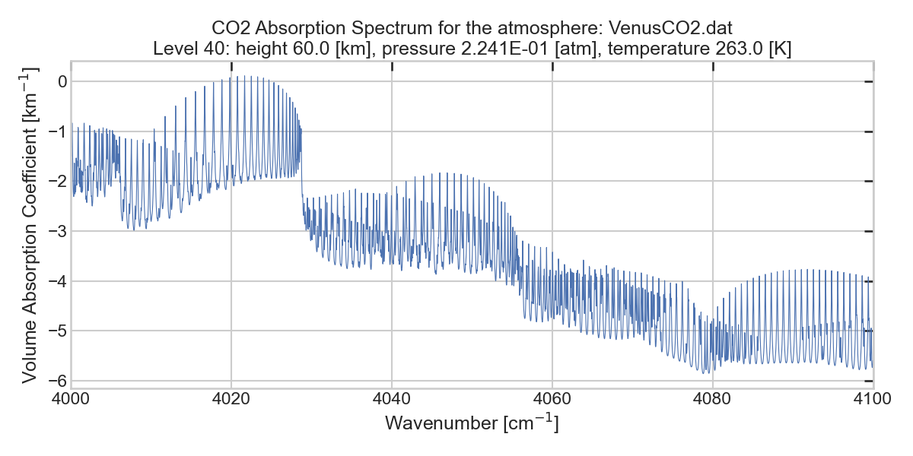
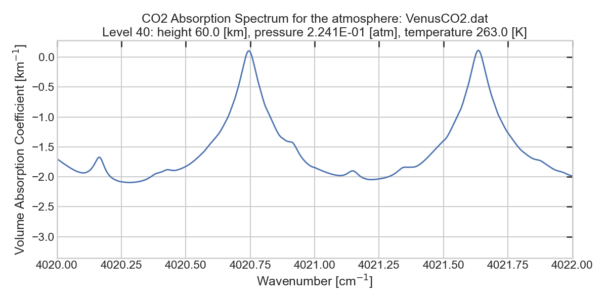

# MARFA
## Table of Contents
- [Overview](#overview)
- [Features](#features)
- [Program Logic and Workflow](#program-logic-and-workflow)
- [Usage scenarious and limitations](#usage-scenarios-and-limitations)
- [Prerequisites](#prerequisites)
- [Quick Start Instructions](#quick-start-instructions)
- [Command Line Parameters](#command-line-parameters)
- [Atmospheric Profile File Structure](#atmospheric-profile-file-structure)
- [Output PT-table structure](#output-pt-table-file)
- [Spectral Databases](#spectral-databases)
- [Line Shapes](#line-shapes)
- [χ-factors](#χ-factors)
- [Other spectroscopic data](#other-spectral-or-molecular-data)
- [Performance Benchmarls](#performance-benchmarks)
- [Troubleshooting](#troubleshooting)
- [License](#license)
- [References](#references)

## Overview
MARFA (Molecular atmospheric Absorption with Rapid and Flexible Analysis) is a versatile tool designed to calculate volume absorption coefficients or monochromatic absorption cross-sections using initial spectroscopic data from spectral databases and atmospheric data from an external file. With MARFA, users can generate absorption PT-tables (look-up tables) for each atmospheric level simultaneously. These PT-tables are produced in a binary format (unformatted files), making them easily integrable into radiative transfer codes. Users have a high degree of control, with the ability to set line cut-off parameter and introduce custom spectroscopic features. Originally developed to facilitate the modeling of radiative transfer in Venus's atmosphere, MARFA's flexible design allows it to be adapted to a wide range of spectroscopic and atmospheric scenarios.

In addition to using and contributing to the source code, it is recommended to interact with the web interface of the tool to better understand its capabilities. The web interface can be accessed at: <URL>

## Features

- **Spectral coverage and resolution**: Applicable for high-resolution line-by-line calculations in far-, mid-, near-IR and visible spectral regions. It roughly covers 10-20000 cm<sup>-1</sup> range. The resolution is about 5 * 10<sup>-4</sup> cm<sup>-1</sup>.

- **Efficient Line-by-Line Technique**: Utilizes an effective interpolation method ([Fomin, 1995](#references)) featuring ten supplemental grids with increasing resolution to accelerate the summation of contributions from a large number of spectral lines. Ten grids are optimal for handling large cut-off conditions. For speed metrics, see [benchmarks](#performance-estimations).

- **Atmospheric Profile Handling**: Computes output absorption spectra for all atmospheric levels in a single runtime.

- **Line Databases Support**: Includes adapted HITRAN-2020 databases for the first 12 molecules (based on HITRAN indexing) within the source code. Other spectral databases can be incorporated manually by processing them into the required format.

- **Line Shapes Support**: Voigt line shape is set as a default. Its implementation in MARFA is based on Kuntz version of Humlicek scheme ([Kuntz, 1997; Humlicek, 1982](#references)). There are some deviaions from the original Kuntz method, for more detaile look at [Line Shapes](#line-shapes) section. Custom line shapes can be manually introduced to the `Shapes.f90` module by matching the specified interface.

- **Line Wings Corrections**: In MARFA various χ-factors functions are implemented to accommodate sub-Lorentzian behavior of spectral line wings of CO<sub>2</sub>. Custom χ-factors can be manually added, by introducing functions matching specified interface.

- **PT-Tables Generation**: Produced spectra are written top unformatted files in PT-format, directly integrable into radiative transfer schemes.

- **Additional Tools**: Provides various scripts for plotting and data processing, facilitating validation and the integration of new data.


## Program Logic and Workflow
The overall flow of the program can be illustrated using the following snippet:

```fortran
    ! determining the starting spectral line from which to start the calculation
    ATMOSPHERIC_LEVELS_LOOP do 
        SUBINTERVALS_LOOP do
            LBL_LOOP do
                ! calculation of spectral feautres
                ! calculation of line shape function
                ! multi-grid logic
            end do LBL_LOOP
            ! cascade interpolation of absorption values to the most fine grid
            ! population of the record in the output file
        end do SUBINTERVALS_LOOP
    end do ATMOSPHERIC_LEVELS_LOOP
```

For each atmospheric level (corresponding to a single P-T value), one output file is generated.

Regardless of the initial spectral interval used for the calculation, it is subdivided into smaller subintervals, each with a length of `deltaWV` = 10 cm<sup>-1</sup>. Each grid in the line-by-line scheme spans the subinterval, and values on the grids are reset before stepping onto new subinterval.


## Usage Scenarios and Limitations

The codes are well-suited for calculating absorption features in scenarios when spectral and atmospheric data are uncertain, such as for terrestrial planets of Solar System (excluding Earth) or exoplanets. They can efficiently handle long cut-off conditions without a significant increase in computational time. Additionally, the codes are designed to allow users to introduce their own functionality. Therefore, if you have your own functions and/or data but lack a computational core, you can use these codes to calculate absorption features over a wide range of input values.

### Important notes:
- The current version lacks testing in real scenarios other than Venus atmosphere. It will be improved with future releases. Current issues, bugs and problems can be found on the [issues page](https://github.com/Razumovskyy/MARFA/issues).

- Calculations are performed for only one molecular species across all atmospheric levels in a single runtime. To calculate spectra for another species, new run must be launched.

- Continuum absorption is not accounted for in this project. This functionality may be added later with contributions from new collaborators.


## Prerequisites
To build and run the source code on your machine, you need to have GFortran (GNU Fortran compiler) and the Fortran Package Manager (fpm) installed. 
The tool is compatible with macOS, Linux operating systems (tests were made on Ubuntu 20.04). Running on Windows is possible, but not recommended.

### Fortran compiler: Gfortran
For installing the `gfortran` you can use [GNU Fortran website](https://gcc.gnu.org/fortran/) or use your system's package manager.
#### Other compilers:
Other fortran compilers were not tested and checked.
### fpm
Installation instructions ara available on the [official website](https://fpm.fortran-lang.org/install/index.html) or on the [fpm github page](https://github.com/fortran-lang/fpm).
### Python3
Python3 is mainly needed for running the plotting scripts and converting binary files to a human readable format.

## Quick start instructions
### Clone the repository and navigate to the project directory:

```
git clone https://github.com/Razumovskyy/MARFA
cd MARFA
```
### Build the project
```
fpm build
```
### Install python packages
In python virtual environment (recommended) run:
```
pip install -r requirements.txt
```
### Choose the atmospheric file
For a quick start you can choose one of the default atmospheric profiles located in the `data/Atmospheres` folder. For example `data/Atmospheres/VenusCO2.dat` which reflects the carbon dioxide profile in the Venus nightside atmosphere.
### Run the project with some command line parameters
For example, to calculate absorption coefficient of carbon dioxide in typical Venus's nightside atmosphere in 4000-4100 cm<sup>-1</sup>:
```
fpm run marfa -- CO2 4000 4100 HITRAN2020 125 VAC VenusCO2.dat
```

Here is a breakdown of the command-line arguments (for more detailed explanation of parameters see [this section](command-line-paramaters)):
- **`CO2`**: The input molecule
- **`4000`** and **`4100`**: The boundaries of the spectral interval of interest (in cm<sup>-1</sup>)
- **`HITRAN2020`**: basefilename for the spectral database
- **`125`**: The line cut-off condition (in cm<sup>-1</sup>)
- **`VAC`** Specifies the target calculated value as **volume absorption coefficient**.
- **`VenusCO2.dat`** The atmospheric profile file to read pressure, tempareature and molecular density data from.

After running this command, the PT-tables for each level from the `VenusCO2.dat` file will be generated in the `output/ptTables` folder. The output files are created in a binary format (unformatted files or so called direct access files) to facilitate faster integration with radiative transfer models.

### Converting to a human-readable output and plotting
To convert a specific PT-table file to a human-readable format and plot the spectra, use the Python script located in the scripts directory. Execute the following command:
```
python scripts/postprocess.py --v1 4000 --v2 4100 --level 40 --resolution medium --plot
```
You can find the file containing human-readable data in the `processedData` folder, named according to the corresponding format, e.g., `output/processedData/CO2_40_VAC_4000-4100.dat`. Below is an example of the file’s contents, which include log information and data: the first column represents wavenumbers [cm<sup>-1</sup>], and the second column shows the log<sub>10</sub> of the volume absorption coefficient (or cross-section if `targetValue` is set to VAC).
```ini
# Input Molecule: CO2
# Cut Off: 125
# Target Value: VAC
# Atmospheric Profile File: VenusCO2.dat
# V1: 4000.0 cm-1
# V2: 4100.0 cm-1
# Resolution: medium
# Level Number: 40
               1       20470
     4000.00000        -1.4572563
     4000.00488        -1.4536923
     4000.00977        -1.4693524
     4000.01465        -1.4902035
      ...
     4099.98535        -5.6071868
     4099.99023        -5.5950541
```
If the `--plot` flag is enabled, a plot of the data set is generated and saved to the `plots` directory with the same name, for example: `output/plots/CO2_40_VAC_4000-4100.png`. Here’s an example:



The `V1` and `V2` values do not necessarily need to match the initial boundaries `Vstart` and `Vend`  used to calculate the PT-table. Instead, you can examine a narrower interval with higher resolution to gain more detailed insights:
```
python scripts/postprocess.py --v1 4020 --v2 4022 --level 40 --resolution high --plot
```



## Command line parameters
### Parameters for `fpm run marfa` command
Required syntax: `fpm run marfa -- arg1 arg2 ... arg7`
| № | Argument      | Description                          | Required | Allowed values |
|-|---------------|--------------------------------------|----------|---------------|
|1| `inputMolecule`   | Species to calculate absorption features of.       | Yes      | First 12 molecules from the HITRAN [molecule metadata list](https://hitran.org/docs/molec-meta/). Molecule must be provided in a text form, e.g. CO2, CH4, O2  | 
|2| `Vstart`       | Left boundary of the spectral interval | Yes   | roughly 10-20000 cm<sup>-1</sup>, but should align with database you take data from | 
|3| `Vend`          | Right boundary of the spectral interval | Yes      | roughly 10-20000 cm<sup>-1</sup>, but should align with database you take data from| 
|4| `databaseSlug` | Title of the spectral database to be used. For more details see the [spectral databases section](#spectral-databases)  | Yes | Base file names from the `data/databases` directory |
|5| `cutOff` | Distance from the center of the line from which absorption from this line is neglected | Yes | recommended values: 10-500 cm<sup>-1</sup>  |
|6| `targetValue` | Absorption feature to be written in the PT-table: volume absorption coefficient (km<sup>-1</sup>) or absorption cross-section (cm<sup>2</sup>/mol)| Yes       | `VAC` (volume absorption coefficient), `ACS` (absorption cross-section) |
|7| `atmProfileFile` | Atmospheric file name, located in the `data/Atmospheres` directory. For the format of the file see: [Atmospheric Profile File Structure](#atmospheric-profile-file-structure)  | Yes | file names from the `data/Atmospheres` directory |


Examples:
```
fpm run marfa -- CO2 660 670 HITRAN2020 25 ACS VenusCO2.dat
fpm run marfa -- H2O 10 3000 HITRAN2020 250 VAC VenusH2O.dat
```

### Parameters for `python scripts/postprocess.py` command
|Argument|Description|Required|Allowed values|
|--------|-----------|--------|--------------|
|subdirectory| Name of the PT-table directory| No, default value is where PT-tables from the latest run are stored. See the `output/ptTables/latest_run.txt` file | Any |
|`v1` | Start wavenumber from which you want to get processed data | Yes | `Vstart` < v1 < v2 < `Vend` |
|`v2` | End wavenumber to which you want to get processed data | Yes | `Vstart` < v1 < v2 < `Vend` |
|`level`| Atmospheric level at which you want to access data. Essentially means, that you access to the file `<level>.ptbin` | Yes | Normally from 1 to 100 (but see your atmospheric file)|
|`resolution`| Resolution at which you want to obtain the data. If you consider large intervals, it is not recommeded to use `high` resolution | Yes | `high` (4.8E-4cm<sup>-1</sup>), `medium` (4.8E-3cm<sup>-1</sup>), `coarse`(4.8E-2cm<sup>-1</sup>) |
| `plot` | Plot the data you postprocessed | No | Provide just a flag |

Examples:
```
python scripts/postprocess.py --v1 4032 --v2 4038 --level 40 --resolution high --plot
python scripts/posprocess.py --v1 10 --v2 3000 --level 50 --resolution coarse
python scripts/postprocess.py directory_name --v1 2500 --v2 --2550 --level 30 --resolution medium
```

## Atmospheric profile file structure
To correctly run the MARFA code, the atmospheric file must adhere to a specific format and be placed in the `data/Atmospheres/` directory. Below is an example of the required format:

```ini
# Atmospheric file example (Haus2015) CO2                                                                     
81
     0.000 0.90918E+02  733.00  0.8694E+26
     2.000 0.80059E+02  717.00  0.7851E+26
     4.000 0.70286E+02  701.00  0.7075E+26
     6.000 0.61599E+02  685.00  0.6366E+26
```
### File Format Breakdown

1. **Header (First Line):**
   - Can be used for keeping info about atmospheric characteristics, such as planet, authors of the source paper, and gas species. This header is ignored during runtime.
   - Example: `# Atmospheric file example (VIRA2) CO2`

2. **Number of Levels (Second Line):**
   - Contains a single number `N` representing the number of atmospheric levels.
   - Example: `81` (indicating 81 levels).

3. **Atmospheric Data (Next N Lines):**
   - Each line contains level-dependent data in four columns:
     - **Column 1:** Height [km]
     - **Column 2:** Total pressure [atm]
     - **Column 3:** Temperature [K]
     - **Column 4:** Number density [mol/(cm<sup>2</sup>*km)] of the given species

   - Example (Venus lower atmosphere):
     ``` 
      0.000 0.90918E+02  733.00  0.8694E+26
      2.000 0.80059E+02  717.00  0.7851E+26
      4.000 0.70286E+02  701.00  0.7075E+26
      6.000 0.61599E+02  685.00  0.6366E+26
     ```

### Important Notes
- **Number of levels:** The recommended number of atmospheric levels is around 100. It is not advised to use atmospheres with more than 200 levels, as this will result in extended computational times, reducing the efficiency of the codes.
- **Units:**
  - The data uses [km] for height to ensure the total absorption coefficient is in [km<sup>-1</sup>].

- **Density Calculation:**
  - It is recommended to provide the number density in [1/(cm<sup>2</sup>*km)] rather than [1/cm<sup>3</sup>]. This is because the density is also used in calculating the partial pressure of species (for Lorentz HWHM), where the units are fixed. Refer to the `pSelf` calculation in the `app/main.f90` file for more details.

- **Directory Placement:**
  - Ensure the atmospheric file is stored in the `data/Atmospheres/` directory to be recognized by the MARFA code.

## Output PT-table file
### General information
- PT-table files are generated and placed somwhere inside `output/ptTables` directory. 
- One PT-table file corresponds to one atmospheric level.
- Name of the PT-table file contains only level number, e.g. `1__.ptbin, 65_.ptbin`.
- PT-table file has an extention `.ptbin`.

### PT-file structure
The file consists of records with data, which could be directly accessed.
- Each record contains an array `RK` of high-resolution absorption data: either cross-section or absorption coefficient 
- Each record contains data about 10 cm<sup>-1</sup> interval (`deltaWV` parameter in the code).
- Resolution of the data is defined by: `deltaWV/NT` = 10/20480 ≈ 4.8828×10<sup>-4</sup>cm<sup>-1</sup>. `NT` is the number of points on the most fine grid.
- Relation between wavenumber of interest and record number: `record_number = int(WV/10)`. For example, if you want to know the value of absorption at 7560 cm<sup>-1</sup>, than you need to access the 756 record.
- Each record is of length `NT * 4` = 20481 * 4 bytes = 81924 bytes = 81,924 kilobytes

Schematic python code snippet for accessing data from this file:
```python
            import numpy as np

            # assuming you need to know absorption in 756 cm^-1
            V1 = 756

            # determining record number where this data stored
            recrod_number = int(V1 / 10.0)

            # number of values in one record
            NT = 20481

            # record length in bytes
            record_length = NT * 4

            with open('1__.ptbin', 'rb') as f:
              # start reading from record with record number "record_number"
              seek_position = (record_number-1) * record_length
              f.seek(seek_position)
  
              # read one record
              record_bytes = f.read(record_length)
  
              # Unpack an array of data using little-endian
              RK = np.frombuffer(record_bytes, dtype='<f4')
  
              # Converting data to float32 format (optional)
              RK = RK.astype(np.float32)
```

## Spectral databases
To calculate absorption cross-sections, line-by-line approach is used which requires a presence of spectral database files. These files must match a specific format, follow a naming rule and be placed in the `data/databases` directory. 

Normally, bank of spectral parameters is compiled in a `.par` file by means of HITRAN web site or from other sources. Before running marfa, to speed up reading operations, `.par` file must be preprocessed into unformatted file (direct access file). The source code provides built-in functionality for users to perform this preprocessing.

Additionaly, the codebase contains 12 files already preprocessed to the required format: `HITRAN2020.01`, `HITRAN2020.02`, etc. These files are direct access files with all necessary spectral data for first 12 molecules (according to HITRAN convention, also see `getSpeciesCode` subroutine in `main.f90` file).

When running marfa, database slug (base filename) must be provided as a command line argument, so to make the executable aware of where from to access line-by-line data. For example:
```
fpm run marfa -- H2O 1200 1600 HITRAN2020 <other parameters>
```
This command implies that the executable will try to access spectral data for the file: `/data/databases/HITRAN2020.01`. 

### Required parameters
Parameters descriptions are taken from HITRAN web site for clarity and compatiblity. In brackets the variable name in the codebase:
- (`lineWV`) The wavenumber of the spectral line transition (cm<sup>-1</sup>) in vacuum
- (`refLineIntensity`) The spectral line intensity (cm<sup>-1</sup>/(molecule * cm<sup>-2</sup>)) at reference temperature T = 296 K
- (`gammaForeign`) The air-broadened half width at half maximum (HWHM) (cm<sup>−1</sup>/atm) at reference temperature T = 296K and reference pressure p = 1 atm.
- (`gammaSelf`) The self-broadened half width at half maximum (HWHM) (cm<sup>−1</sup>/atm) at reference temperature T = 296K and reference pressure p = 1 atm.
- (`lineLowerState`) The lower-state energy of the transition (cm<sup>-1</sup>)
- (`foreignTempCoeff`) The coefficient of the temperature dependence of the air-broadened half width
- (`jointMolIso`) **CUSTOM**: Integer number containing information about both `Mol` (The molecular species identification (ID) number) and `Iso` (The isotopologue ID number). 
- (`deltaForeign`) The pressure shift (cm<sup>-1</sup>/atm) at reference temperature T = 296 K and pressure p = 1 atm of the line position with respect to the vacuum transition wavenumber. 

**Note:** `jointMolIso` is customized because of linear structure of the files with TIPS and molecular mass data (linear on isotope numbers). In the `app/processParFile.f90` file there is an `N_MOL_ISO` array which is needed for smooth access to the isotope by one number. I address you to check this implementation there and in those parts of code where TIPS and molecular masses are accessed.

### Preprocessing user's .par file
For that you can use `app/processParFile.f90` program, for example:
```
fpm run processParFile -- HNO3 HITRAN2020 path/to/file.par
```
After running this command `HITRAN2020.12` file will be saved in the `data/databases` directory and could be accessed when running the main program:
```
fpm run marfa -- HNO3 <VStart> <VEnd> HITRAN2020 <other parameters>
```

### Structure of the database files
Each direct access file in the `data/databases` folder has the following structure:
- File consists of records, each record contains data related to one spectral line
- Each record contains required parameters from the above section.
- Parameter `LineWV` is stored in double precision, 8 bytes are required for it. For other 7 parameters, 4 bytes are allocated apiece. Thus, the total length of a record is 36 bytes.

## Line Shapes

MARFA program suite intends to allow user to switch easily between different line shapes. Modular structure of the project allow users to include their shape functions directly to the `Shape.f90` module and to set the desired line shape function for calculation. Currently `Shape.f90` module contains only Voigt function which is set as default. Simple line shapes like Doppler and Lorentz can be found in `Spectroscopy.f90` module along with other useful relevant functions (`Spectrscopy.f90` can be treated as a little library for spectrosocopic calculations).

### Voigt function

Implementation of the Voigt shape function K(x,y) is based on the study by Kuntz ([Kuntz, 1997](#references)). However, there are few deviaitions that need to be mentioned:

- A recursive algorithm is not used; simple if-else blocks determine the region in the (x,y)-plane
- **Region 0** is introduced for x > 15, where the Voigt shape transforms to Lorentz profile
- Border between **Regions 3 and 4** has been adjusted
- Asymptotic approximations based on series expansion are introduced in **Region 4**. 

For more details, refer to the [original preprint](#how-to-cite-this-work).

### Introducing custom line shapes
To define a custom shape, you need to provide a Fortran function to the `Shapes.f90` module. The function must satisfy the following requirements:

1. **Conformance to the abstract interface** <br>
The function must match `shape` abstract interface defined in the `Interfaces.f90` module. Specifically, it means that the function expects only one value `X` - a distance from the center of the line shape (assumed to be symmetric), `X` must be of double precision. The function returns one result value of type `real`.

2. **Calculation of individual cross-section** <br>
The function in the `Shapes.f90` module must directly return the individual cross-section, including the multiplication of the line profile function by the line intensity. This approach is chosen for optimization purposes. Thus, multiplication on the temperature-dependent intensity must be provided. You can use predefined line intensity function `intensityOfT` in `Spectroscopy.f90` module. If you want to use custom intensities, you might need to change `intensityOfT` function.

Example implementation:
```fortran
    real function myLineShape(X)
        real(kind=DP), intent(in) :: X ! distance from a line center

        ! ... YOUR LOGIC HERE

        myLineShape = myLineShape * intensityOfT(temperature) ! THIS LINE MUST BE PROVIDED
    end function myLineShape
```


### Setting a new line shape
To use a new line shape for absorption calculations, update the `setShapeFunction` subroutine in the `Shapes.f90` module. By default, the `shapeFuncPtr` pointer is set to the `voigt` function. To use a different function, update the pointer as follows:
```fortran
shapeFuncPtr => myLineShapeFunction
```

## χ-factors
There is an indication that the far wings of spectral lines tend to diverge from expected Lorentzian or Voigt behavior. To address that, χ&#8204;-factor could be applied. 

In MARFA code, currently there are several χ&#8204;-factors implemented, which describe sub-Lorentzian behavior of CO<sub>2</sub> rotational lines. They could be found in the `ChiFactors.f90` module. These corrections are primarilly used for **Venus atmosphere conditions**. Below is a list of implemented functions with references to studies:
| χ-factor | Reference                  |
|----------|----------------------------|
| `noneChi`| no correction (default) |
| `tonkov` | [Tonkov et al. (1996)](#references)       |
| `pollack`| [Pollack et al. (1993)](#references)      |
| `perrin` | [Perrin and Hartmann (1989)](#references) |

### Introducing custom χ-factors

To define a custom χ-factor, you need to provide a Fortran function to the `ChiFactors.f90` module. The function must conform to the `chiFactor` abstract interface defined in the `Interfaces.f90` module. Specifically, it means that the function must be `pure` and it expect two arguments: one value `X` - a distance from the center of the line shape and the integer code of molecule. The function returns one result value of type `real`.

To avoid confusion of applying χ-factors to different species, `if` block check is added. If the `moleculeIntCode` not equal to the intended one, than χ-factor is set to 1.

Example implementation: 
```fortran
    pure function myChi(X, moleculeIntCode) result(myChiFactor)

        implicit none
        real :: myChiFactor
        real(kind=DP), intent(in) :: X
        integer, intent(in) :: moleculeIntCode

        tonkovFactor = 1. ! default value
        
        ! set the code value in the if block here e.g. 2 - CO2:
        if (moleculeIntCode == 2) then 
            ! χ-factor correction logic here 
        end if
    
    end function  myChi
```

To use a new χ-factor function for absorption calculations, update the `setChiFactorFunction` subroutine in the `ChiFactors.f90` module. By default, the `shapeFuncPtr` pointer is set to the `noneChi` function, meaning no currection applied. To use a different function, update the pointer by setting it to one of the functions, for example:
```fortran
shapeFuncPtr => myChi
```
## Other spectral or molecular data
#### TIPS 
Total internal partition sums (TIPS) are needed for obtaining temperature-dependent spectral intensities. How the TIPS are implemented in MARFA:
- TIPS values could be found in the file inside `data/TIPS/TIPS.dat` file.
- TIPS data are taken from Gamache study ([Gamache, 2017](#references)).
- Data are available for first 74 isotopologues (first 12 molecules: H2O, CO2, O3, N2O, CO, CH4, O2, NO, SO2, NO2, NH3, HNO3)
- Covered temperature range is 20 - 1000 K with 2 degree step.
- For chosen isotope TIPS as function of temperature can be accessed through the function: `TIPSofT` located in the `Spectroscopy.f90` module.

##### Outlook
- I plan to add recent TIPS ([Gamasche, 2021](#references))
- It might be better to organize input TIPS as en external subroutine based on Gamache's code Fortran or Python: `TIPS_2021_v1p0.for`, `BD_TIPS_2021_v1p0.for` or `TIPS_2021_v1p0.py`.
#### Molecluar masses
Molecular masses are used for calculation of Doppler half-widths. Data is available directly in the `MolecularMasses.f90` module. `WISO` array contains weights data for 124 isotopolouges of first 42 molecules according to HITRAN molecules numbering system.
## Performance benchmarks
Execution time **at one atmospheric level** largerly depends on number of spectral lines and line cut-off condition. Here are some benchmarks for the **Apple M1 chip**:
|species|spectral interval (cm<sup>-1</sup>)|number of lines|cut off condition (cm<sup>-1</sup>)|execution time (s)|
|---------|-----------------|---------------|-----------------|----------------|
| CO<sub>2</sub> | 10 - 1000 (far-IR) | 128934 | 25 | 0.3 |
| CO<sub>2</sub> | 10 - 1000 (far-IR) | 139291 | 250 | 1.32 |
| H<sub>2</sub>O | 1000 - 4000 (mid-IR) | 84119 | 25 | 0.29 |
| H<sub>2</sub>O | 1000 - 4000 (mid-IR) | 92566 | 250 | 0.95 |
|  CO<sub>2</sub> | 10 - 14000 (whole IR) | 543481  | 250 | 6 |
| H<sub>2</sub>O | 10 - 14000 (whole IR) | 329258 | 250 | 3.8 |

**Note**: no line intensity cut-off condition applies, so all the lines from HITRAN2020 database counted.

Loop over atmospheric levels is currently not parallelized but I plan to do it with OpenMP in near time. Thus, currently the time of processing a full atmospheric profile is linear to number of levels.

Check the [issues](https://github.com/Razumovskyy/MARFA/issues) labeled with **optimization** flag, to understand how further the codes are planned to be optimized.


## Troubleshooting
Feedback is awaited to populate this section. Most potential issues, such as invalid user inputs, in the Fortran source code and Python scripts are handled with clear error messages to facilitate troubleshooting.


## How to cite this work
Razumovskiy, Mikhail, Boris Fomin, and Denis Astanin. _MARFA: An Effective Line-by-line Tool for Calculating Absorption Coefficients and Cross-sections in Planetary Atmospheres._ arXiv preprint arXiv:2411.03418 (2024).

## License
This project is licensed under the MIT License. See the LICENSE file for more details.

## References
- Razumovskiy, Mikhail, Boris Fomin, and Denis Astanin. _MARFA: An Effective Line-by-line Tool for Calculating Absorption Coefficients and Cross-sections in Planetary Atmospheres._ arXiv preprint arXiv:2411.03418 (2024).
- Fomin, B. A. _Effective interpolation technique for line-by-line calculations of radiation absorption in gases._ Journal of Quantitative Spectroscopy and Radiative Transfer 53.6 (1995): 663-669.
- Tonkov, M. V., et al. _Measurements and empirical modeling of pure CO<sub>2</sub> absorption in the 2.3-μm region at room temperature: far wings, allowed and collision-induced bands._ Applied optics 35.24 (1996): 4863-4870.
- Pollack, James B., et al. _Near-infrared light from Venus' nightside: A spectroscopic analysis._ Icarus 103.1 (1993): 1-42.
- Perrin, M. Y., and J. M. Hartmann. _Temperature-dependent measurements and modeling of absorption by CO<sub>2</sub>-N<sub>2</sub> mixtures in the far line-wings of the 4.3 μm CO<sub>2</sub> band._ Journal of Quantitative Spectroscopy and Radiative Transfer 42.4 (1989): 311-317.
- Gamache, Robert R., et al. _Total internal partition sums for 166 isotopologues of 51 molecules important in planetary atmospheres: Application to HITRAN2016 and beyond._ 
- Gamache, Robert R., et al. _Total internal partition sums for the HITRAN2020 database._ Journal of Quantitative Spectroscopy and Radiative Transfer 271 (2021): 107713.
- Gordon, Iouli E., et al. _The HITRAN2016 molecular spectroscopic database._ Journal of quantitative spectroscopy and radiative transfer 203 (2017): 3-69.
Journal of Quantitative Spectroscopy and Radiative Transfer 203 (2017): 70-87.
- I. E. Gordon, L. S. Rothman, R. J. Hargreaves, R. Hashemi, E. V. Karlovets, F. M. Skinner, et al., _The HITRAN2020 molecular spectroscopic database_, J. Quant. Spectrosc. Radiat. Transfer   277, 107949 (2022). [doi:10.1016/j.jqsrt.2021.107949]
- Humlíček, Josef. _Optimized computation of the Voigt and complex probability functions._ Journal of Quantitative Spectroscopy and Radiative Transfer 27.4 (1982): 437-444.
- Kuntz, M. _A new implementation of the Humlicek algorithm for the calculation of the Voigt profile function._ Journal of Quantitative Spectroscopy and Radiative Transfer 57.6 (1997): 819-824.
